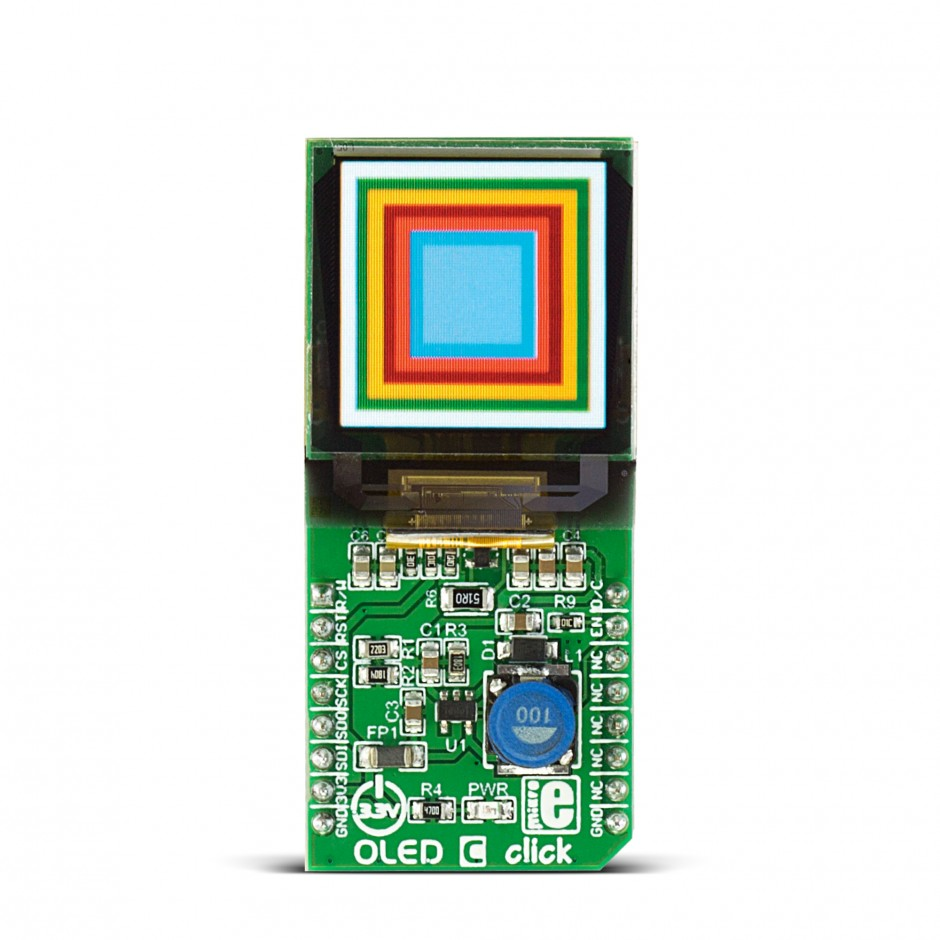
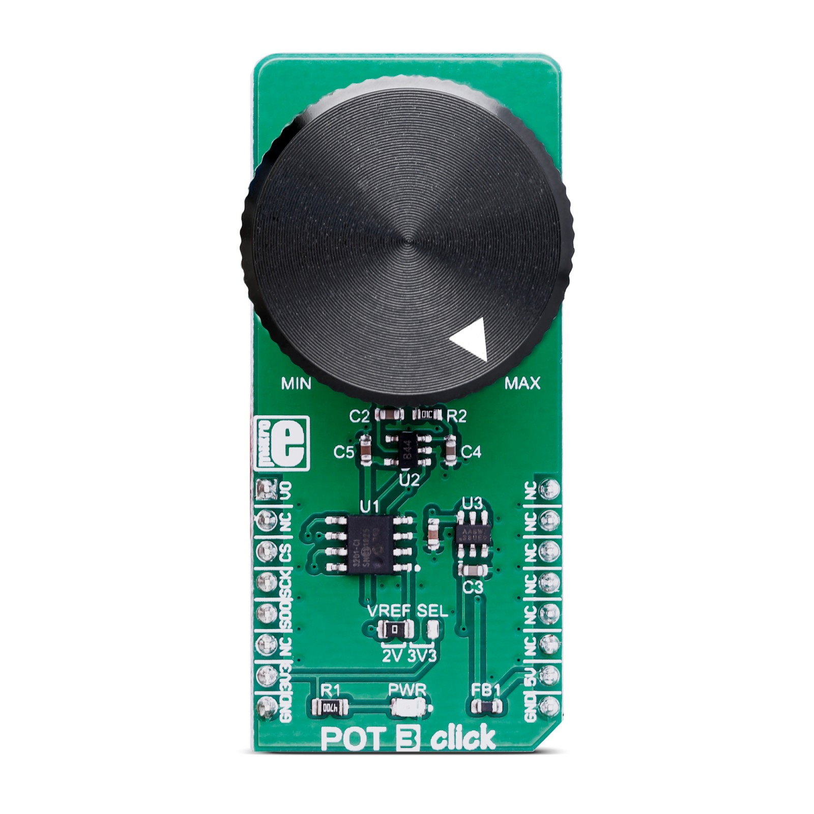

# Analog-to-Digital Converter with Computation (ADCC) and Context Switching — ADCC with Context Switching Triggered by APM Using PIC18F56Q71 Microcontroller with MCC Melody

This code example demonstrates how to perform a conversion using the Analog-to-Digital Converter with Computation (ADCC) and Context Switching triggered by the Analog Peripheral Manager (APM). By triggering the ADCC with Context Switching with the help of APM, the ADCC with Context Switching peripheral is turned on only when a conversion needs to be performed and the power efficiency increases. The analog input channel routed to the ADCC with Context Switching is the voltage from a POT 3 CLICK board and for visualization purposes a OLED C CLICK board is used. The conversion result is displayed on a bar meter interface on the OLED display along with the APM status.

## Related Documentation

More details and code examples on the AVR64DD32 can be found at the following links:

- [PIC18F56Q71 Product Page](https://www.microchip.com/en-us/product/PIC18F56Q71)
- [PIC18F56Q71 Code Examples on GitHub](https://github.com/orgs/microchip-pic-avr-examples/repositories?q=pic18f56q71&type=all&language=&sort=)

## Software Used

- [MPLAB® X IDE](http://www.microchip.com/mplab/mplab-x-ide) v6.05 or newer
- [MPLAB® X IPE](https://www.microchip.com/en-us/tools-resources/production/mplab-integrated-programming-environment) v6.05 or newer
- [MPLAB® XC8](http://www.microchip.com/mplab/compilers) v2.40 or newer
- [PIC18F-Q Series Device Pack](https://packs.download.microchip.com/) v1.15.243 or newer

## Hardware Used

- The PIC18F56Q71 Curiosity Nano Development board is used as a test platform:
   

- Curiosity Nano Adapter:
   

- OLED C CLICK board (mikroBUS socket 1):
   

- POT 3 CLICK board (mikroBUS socket 3):
   

 

## Operation

To program the Curiosity Nano board with this MPLAB® X project, follow the steps provided in the [How to Program the Curiosity Nano Board](#how-to-program-the-curiosity-nano-board) chapter.  

## Setup

The following configurations must be made for this project:

- System clock: 64 MHz
- Watchdog Timer: disabled
- ADCC with Context Switching:
  - Input Configuration: Single-Ended mode
  - Auto-conversion Trigger Source: Analog Peripheral Module
  - Result Format: Right justified
  - VDD: 3.3 V
  - Clock Selection: ADCRC
  - Enable Context 1:
    - Positive Channel Selection: ANA4
    - Positive Voltage Reference: VDD
    - Operating Mode Selection: Basic mode
- APM:
  - Clock Source: LFINTOSC
  - Requested Period: 2 sec
  - APM Events: Start1 -> ADCD, End1 -> ADCD, Start2 -> ADCD, End2 -> ADCD
  - Requested Start1: 0.25 sec
  - Requested End1: 0.5 sec
  - Requested Start2: 1 sec
  - Requested End2: 1.5 sec
  - APM: enabled
- SPI1:
  - Operation Mode: Host
  - SPI Mode: SPI Mode 0
  - Input Data Sampled At: Middle
  - Requested Clock Frequency: 500 KHz
  - Clock Source Selection: FOSC

| Pin | Configuration  |
| :-: | :------------: |
| RA1 | Digital output |
| RA3 | Digital output |
| RA4 |  Analog input  |
| RA5 | Digital output |
| RB0 | Digital output |
| RB3 | Digital output |
| RC2 | Digital output |
| RC5 | Digital input  |
| RC6 | Digital output |

**Note:** The OLED CLICK driver requires the involved pins to have certain labels according to the table below:

| Pin |   Label   |
| :-: | :-------: |
| RA1 | oledC_RW  |
| RA3 | oledC_RST |
| RA5 | oledC_nCS |
| RB0 | oledC_DC  |
| RB3 | oledC_EN  |
| RC6 | oledC_SCK |

 

## Demo

The OLED C CLICK board is used to visualize the APM Status and the ADCC with Context Switching conversion result in a graphical format.

 

## Summary

This code example shows how to configure the ADCC with Context Switching to be triggered by the APM. It uses the MPLAB® Code Configurator and presents the conversion result using the OLED C CLICK board.

  
[Back to Top](#analog-to-digital-converter-with-computation-adcc-and-context-switching--adcc-with-context-switching-triggered-by-apm-using-pic18f56q71-microcontroller-with-mcc-melody)
 

## How to Program the Curiosity Nano Board

This chapter demonstrates how to use the MPLAB® X IDE to program a PIC® device with an Example_Project.X. This is applicable to other projects.

1.  Connect the board to the PC.

2.  Open the Example_Project.X project in MPLAB® X IDE.

3.  Set the Example_Project.X project as main project.
     Right click the project in the **Projects** tab and click **Set as Main Project**.
     

4.  Clean and build the Example_Project.X project.
     Right click the **Example_Project.X** project and select **Clean and Build**.
     

5.  Select **PICxxxxx Curiosity Nano** in the Connected Hardware Tool section of the project settings:
     Right click the project and click **Properties**.
     Click the arrow under the Connected Hardware Tool.
     Select **PICxxxxx Curiosity Nano** (click the **SN**), click **Apply** and then click **OK**:
     

6.  Program the project to the board.
     Right click the project and click **Make and Program Device**.
     

 

- [Back to Setup](#setup)
- [Back to Demo](#demo)
- [Back to Summary](#summary)
- [Back to Top](#analog-to-digital-converter-with-computation-adcc-and-context-switching--adcc-with-context-switching-triggered-by-apm-using-pic18f56q71-microcontroller-with-mcc-melody)
